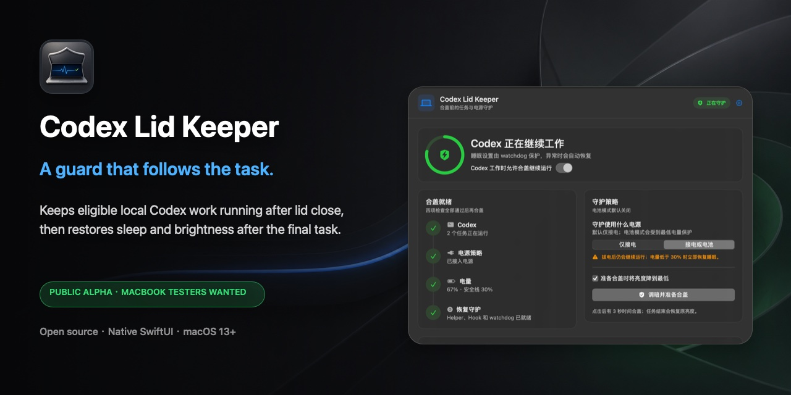
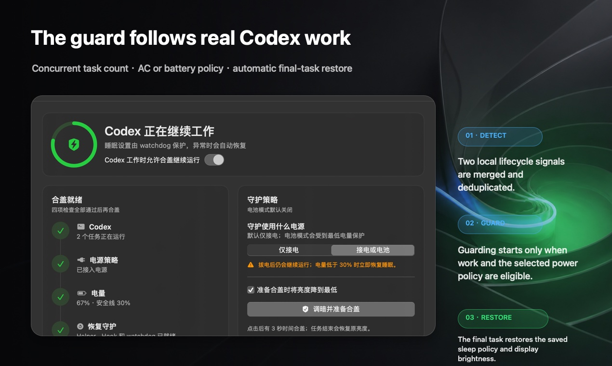
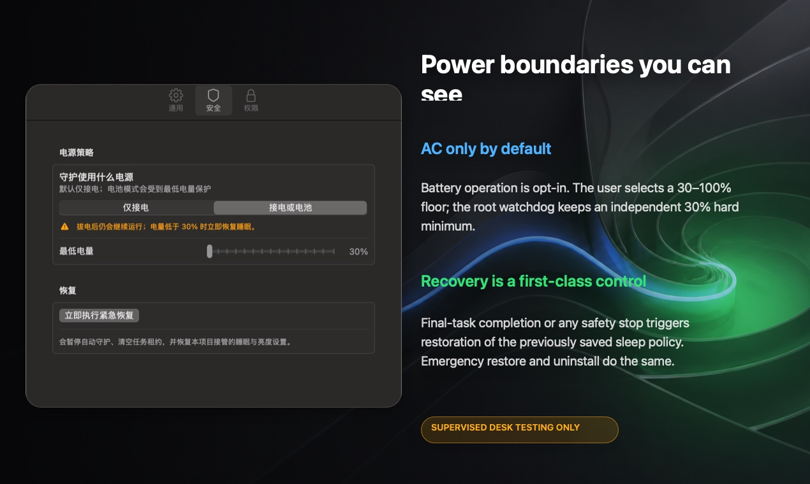

# Codex Lid Keeper

[English](README.md) | 简体中文

[](https://github.com/Apex-Studio-He/codex-lid-keeper/actions/workflows/ci.yml)
[](https://github.com/Apex-Studio-He/codex-lid-keeper/releases/tag/v0.3.0-app-alpha)
[](https://github.com/Apex-Studio-He/codex-lid-keeper)
[](LICENSE)



> **v0.3.0 公开 Alpha｜正在招募 MacBook 实机测试者**
>
> 这版已经可以认真测试，但还不适合无人值守。第一次合盖前，请先看完
> [测试指南](TESTING.md)，并把电脑放在坚硬、开阔、通风的桌面上。

Codex Lid Keeper 会跟着本地 Codex 的真实任务走：有符合条件的任务时，允许
MacBook 合盖后继续工作；最后一个任务结束，或者供电、电量、心跳等安全条件不再
满足时，再把原来的睡眠策略和保存过的屏幕亮度恢复回来。

它不是一个一直开着的“防睡眠开关”。守护什么时候开始、什么时候结束，都由
Codex 任务生命周期决定。

## 直接下载

v0.3.0 的 DMG 已经包含 Apple Silicon / Intel 通用 App、完整系统组件安装器、
卸载器和中英文安全说明。

- [下载 Universal DMG](https://github.com/Apex-Studio-He/codex-lid-keeper/releases/download/v0.3.0-app-alpha/Codex-Lid-Keeper-v0.3.0-universal.dmg)
- [下载 SHA256SUMS](https://github.com/Apex-Studio-He/codex-lid-keeper/releases/download/v0.3.0-app-alpha/SHA256SUMS)
- [查看 v0.3.0 发布说明](https://github.com/Apex-Studio-He/codex-lid-keeper/releases/tag/v0.3.0-app-alpha)

把 DMG 和 `SHA256SUMS` 放在同一个目录，先校验：

```bash
shasum -a 256 -c SHA256SUMS
```

然后按这个顺序安装：

1. 打开 DMG；
2. 按住 Control 点击 **Install Codex Lid Keeper.command**，选择“打开”；
3. 终端会通过 macOS 标准 `sudo` 请求管理员权限；
4. 安装完成后，在 Codex 里打开 `/hooks`，检查并信任五个生命周期 Hook。

不要只把 App 拖进 `/Applications`。图形界面还需要固定功能 Helper、恢复
watchdog、用户后台任务、精确 sudoers 规则和 Codex Hooks；只拖 App 会变成
“能打开，但核心功能没装全”。DMG 里的安装程序会把这些组件一起放到正确位置。

### 为什么 macOS 会提醒“无法验证开发者”

v0.3.0 里的 App 已做 ad-hoc 签名，macOS 可以据此检查 Bundle 内部的签名结构，
但它不能证明发布者身份。这一版还没有 Developer ID 签名，也没有通过 Apple
notarization；第一次打开时，macOS 会正常拦一下。

确认下载来源、GitHub Release 同页的 SHA-256 和
[安全说明](SECURITY.zh-CN.md)没有问题后，使用“按住 Control 点击 → 打开”。
不要为了这个 Alpha 在系统范围内关闭 Gatekeeper。

你不会在 App 里看到账号或密码输入框，这是刻意设计的。密码只由终端里的
`sudo` 读取，Codex Lid Keeper 看不到，也不会保存。

## 守护为什么要跟着任务走



- **看真实工作，不看窗口开没开**：近期 rollout 里的开始 / 结束标记负责立即
  识别新任务和已经在跑的任务；受信任的 Hook 再提供一条独立链路。
- **并发任务会去重**：只读结果与 Hook 租约按 Codex session 合并，同一个任务
  不会算两遍。
- **漏掉结束 Hook 也能收尾**：rollout 出现 `task_complete` 后，只清理完全
  对应的 `session_id + turn_id`，不会误伤同一会话里后来开始的新任务。
- **最后一个任务说了算**：先结束一个任务不会提前恢复；还有任务在跑，守护就
  继续。
- **拿不到数据就老实显示 `—`**：不会拿演示数字冒充真实任务数。

## 供电和恢复边界



- 默认只在接电时运行；
- “接电或电池”必须由用户主动打开，并设置 30%—100% 的最低电量；
- root watchdog 另有不可降低的 30% 硬底线；
- “准备合盖”必须确认恢复 LaunchDaemon 已加载、用户 Agent 有存活 PID 并持有
  daemon 锁，而且 root 电源心跳仍然新鲜；调暗屏幕前还会立即复查；
- AC 与电池原配置分别记录，恢复时分别写回，不会一律强制成 `0`；
- 合盖准备会保存当前亮度，倒计时三秒后调到最低，结束或取消时恢复；
- 主窗口、菜单栏和设置页都有紧急恢复。

下面任一情况出现，程序都会尝试恢复：

- 最后一个任务结束；
- 用户暂停、清空任务或点击紧急恢复；
- 当前供电不符合所选策略；
- 电量低于安全线；
- 任务租约过期；
- 用户后台进程停止心跳超过两分钟；
- 卸载程序运行。

## 先把风险说透

项目用到了 macOS 没有公开文档的 `pmset disablesleep`。Apple 以后可能改变
甚至移除这个行为。

**不要把合盖运行中的 MacBook 放进背包、内胆包、抽屉、床铺、沙发或任何不通风
的地方。** 第一次测试请放在开阔桌面上，人留在旁边观察。机身明显发热，或者
电源状态说不清时，立即停止。

自动测试能证明状态机和恢复逻辑，但不能替所有 MacBook 证明合盖网络、温度和
机型兼容性，这也是项目现在最需要实机反馈的部分。

## 隐私边界

程序不会为提示词、模型回复、工具输入或工具输出建立数据字段，也不会把这些内容
写进自己的状态或日志。

只读检测只取近期任务的标识、rollout 路径、工作目录和更新 / 归档信息；每个近期
rollout 最多检查末尾 4 MiB，并且只解码生命周期外层、
`task_started` / `task_complete` 和 `turn_id`。完整路径进入 Keeper 状态前，
只保留最后一级项目名。

Hook 只解码：

- `session_id`
- `turn_id`
- `cwd`（写入前只留最后一级）
- `hook_event_name`

完整权限边界和数据流见[安全说明](SECURITY.zh-CN.md)。

## 安装器会改哪些地方

安装器会先检查 App 标识、plist、当前芯片架构和包内签名完整性，再请求管理员
权限。通过后会安装：

- `/Applications/Codex Lid Keeper.app`；
- `/Library/PrivilegedHelperTools` 里的 root 固定功能 Helper；
- root 恢复 LaunchDaemon；
- 当前用户的协调 LaunchAgent；
- 只放行三条固定电源命令的 sudoers 规则；
- 五个合并后的 Codex 生命周期 Hook。

Hook 的安装、校验和移除已经改成原生 Swift。下载 Release 的用户不需要额外安装
Python、Swift、Xcode 或 Command Line Tools。

## 从源码构建

只有参与开发或希望逐行审查并本机编译时，才需要 macOS 13+、Swift 6 Command
Line Tools 和 Python 3：

```bash
git clone https://github.com/Apex-Studio-He/codex-lid-keeper.git
cd codex-lid-keeper
./scripts/build.sh
/usr/bin/python3 scripts/test_hooks_config.py
/usr/bin/python3 scripts/test_e2e.py --binary .build/release/codex-lid-keeper
./scripts/build_distribution.sh
```

安装本机构建的 App 和系统组件：

```bash
./scripts/install.sh
```

当前自动验证基线：

```text
58/58 项原生自测通过
5 项 Hook 兼容测试通过
隔离 dry-run 生命周期测试通过
Universal DMG 验包通过
```

这些测试使用模拟环境或隔离目录，不会开启真实 sleep override。覆盖范围包括三任务
立即识别、漏 `Stop` 后精确恢复、旧 turn 不伤新 turn、两路信号去重、事件队列
容量与崩溃重放、AC / 电池模式、原值恢复、低电量、心跳超时、原生 Hook 配置和
旧状态迁移。

## 29 秒界面预览

[查看界面预览视频](docs/demo/codex-lid-keeper-ui-walkthrough.mp4)。

这个视频由真实界面截图制作，用来快速说明安全控制，**不是合盖实机证明**。真正
能证明“合盖后任务继续、最后自动恢复”的演示，必须有连续的外部合盖镜头、可观察
的任务进度和恢复结果；没有拍到，就不拿动画代替。

## 紧急恢复

已经安装时：

```bash
"/Applications/Codex Lid Keeper.app/Contents/Resources/codex-lid-keeper" emergency-restore
```

在源码目录里：

```bash
./scripts/emergency-restore.sh
```

它会暂停自动守护、清空任务租约，并恢复本项目接管的睡眠和亮度状态。

## 卸载

打开 DMG，运行 **Uninstall Codex Lid Keeper.command**；也可以在源码目录执行：

```bash
./scripts/uninstall.sh
```

卸载器会先恢复本项目接管的电源状态，再移除 App、Helper、sudoers、launchd、
登录项和本项目 Hooks。用户日志与配置默认保留，最后会打印保存位置。

## 现在最需要你帮忙测什么

- Apple Silicon 和 Intel MacBook；
- macOS 13、14、15 以及更新版本；
- 1、2、3 个并发 Codex 任务；
- 仅接电和允许电池两种策略；
- 拔电与低电量恢复；
- 有人看守时的合盖网络与任务进度；
- 开阔桌面上的温度表现；
- 紧急恢复和最后任务恢复。

先按[测试指南](TESTING.md)操作，再通过
[实机测试表](https://github.com/Apex-Studio-He/codex-lid-keeper/issues/new?template=test_report.yml)
反馈。请删掉提示词、对话、完整 Hook、session ID 和没有打码的个人路径。

## 目前还缺什么

- Developer ID 签名和 Apple notarization；
- 自动更新；
- 按温度自动退出；
- 足够完整的 MacBook / macOS 兼容数据；
- 对未来 macOS 未公开行为的保证；
- 无人值守或封闭空间运行支持。

## 更多资料

- [测试指南](TESTING.md)
- [架构说明](docs/ARCHITECTURE.md)
- [安全说明](SECURITY.zh-CN.md) |
  [Security policy](SECURITY.md)
- [贡献指南](CONTRIBUTING.md)
- [变更记录](CHANGELOG.md)
- [发布素材与渠道检查表](docs/LAUNCH-KIT.md)

## 致谢与许可证

设计阶段参考了
[CodexAwake](https://github.com/Lu233/CodexAwake)、
[wake](https://github.com/Moarram/wake) 和
[claude-awake](https://github.com/Ami3466/claude-awake)。
仓库没有复制这些项目的源码。

Codex Lid Keeper 不是 Apple 或 OpenAI 官方产品。项目使用
[MIT License](LICENSE)。
