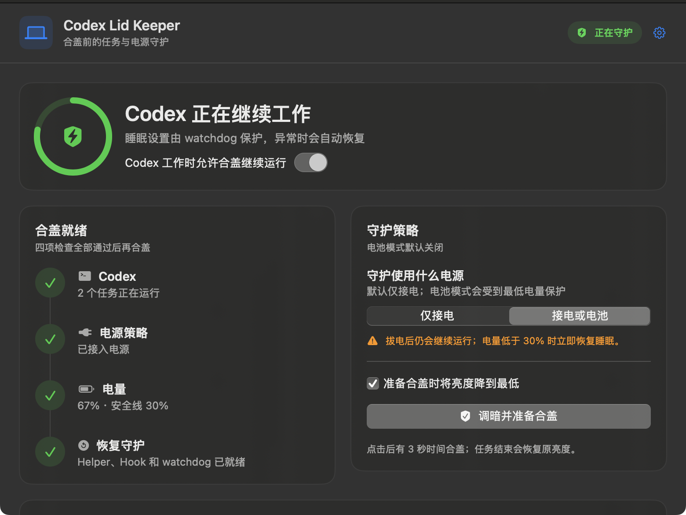
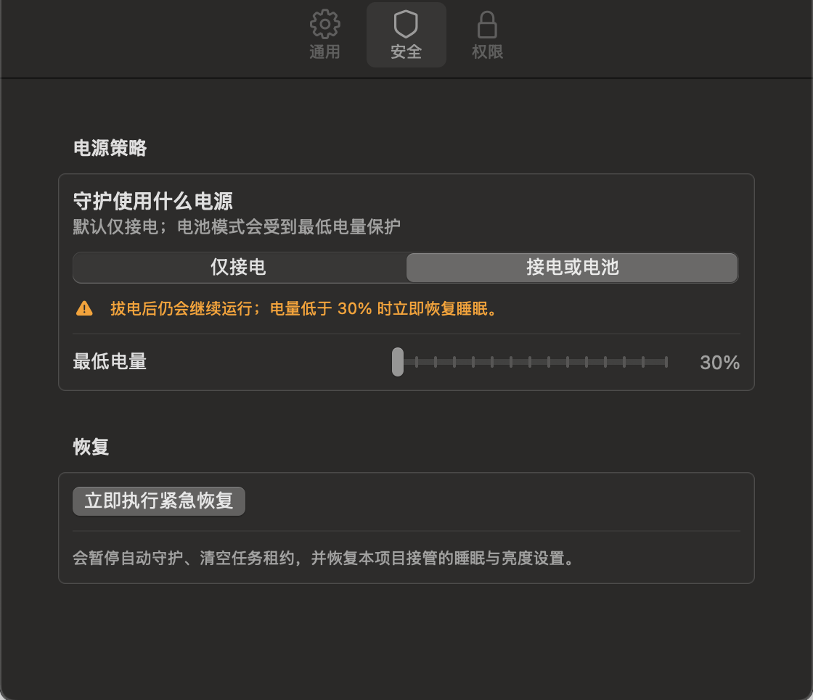

# Codex Lid Keeper

[English](README.md) | 简体中文

> **v0.2.2 App Alpha｜正在招募 MacBook 实机测试者**
>
> 如果你愿意在通风良好的桌面上做一次受控合盖测试，请先阅读
> [测试指南](TESTING.md)，再通过
> [测试反馈](https://github.com/Apex-Studio-He/codex-lid-keeper/issues/new/choose)
> 告诉我们你的机型、macOS 版本和测试结果。

让本地 Codex 在 MacBook 合盖后继续工作，最后一个任务结束后，自动恢复原来的
睡眠与屏幕亮度。





## 你能直接看到什么

- **真实任务状态**：只读检测会在 Codex 写下开始 / 结束标记时立即更新，旧版
  turn 日志负责兼容兜底，受信任的 Hook 再提供一条独立链路；不会把“Codex
  窗口开着但没干活”算成任务。
- **并发数量准确**：只读检测与 Hook 会按同一个 Codex 会话去重。两个任务就是
  `2`，同一个任务不会被重复计算。
- **漏掉结束 Hook 也能自己恢复**：rollout 发现 `task_complete` 后，只清理
  对应的那一个 turn；同一会话里后来开始的新任务不会被误删。
- **实时电量与供电状态**：直接读取 macOS 电源信息；两种任务信号都不可用时，
  数量显示 `—`，不会拿演示数字冒充真实数据。
- **两种守护策略**：
  - 仅接电时运行（默认）；
  - 接电或使用电池都可运行，并受最低电量保护。
- **合盖前自动调暗**：保存内置屏幕原亮度，倒计时三秒后降到最低；任务结束、
  取消准备或 App 退出时恢复。
- **菜单栏常驻**：不用一直开着主窗口，也能看状态、切换供电策略和紧急恢复。
- **四项合盖检查**：Codex、电源策略、电量、恢复守护都通过后，才允许点击
  “调暗并准备合盖”。

## 先说清楚风险

这个项目使用 macOS 没有公开文档的 `pmset disablesleep`。Apple 可能在系统
更新中改变或移除它。

**不要把合盖运行中的 MacBook 放进背包、内胆包、抽屉、床铺或任何不通风的
空间。** 第一次测试请放在开阔桌面上，人留在旁边观察温度。

## 安装

需要 macOS 13 或更高版本、Apple Command Line Tools、当前版本的 Codex
桌面端，以及一个能输入管理员密码的账户。

```bash
git clone https://github.com/Apex-Studio-He/codex-lid-keeper.git
cd codex-lid-keeper
./scripts/install.sh
```

安装脚本会先构建并跑完自动测试，然后：

1. 把 `Codex Lid Keeper.app` 安装到 `/Applications`；
2. 安装 root 所有的固定功能 Helper；
3. 安装用户后台进程和独立的 root watchdog；
4. 备份并合并五个 Codex Hook，不覆盖其他工具已有的 Hook；
5. 添加只允许固定电源命令的 sudoers 规则；
6. 启动 App。

管理员密码会由 macOS 的标准 `sudo` 流程在终端里询问，不会在 App 里弹出账号
密码框。Codex Lid Keeper 不会读取或保存你的密码。

Codex 如果提示 Hook 定义发生变化，请打开 `/hooks`，检查并信任
Codex Lid Keeper 的五个 Hook。只读检测可以补上安装前已经开始的任务；受信任的
Hook 则是长期使用时更稳定的生命周期信号。

> 当前 Alpha 由本机从源码构建并使用 ad-hoc 签名，还没有 Developer ID
> notarization。请先检查安装脚本与[安全说明](SECURITY.zh-CN.md)。

## 它怎么判断 Codex 正在工作

任务检测有两条本地链路。第一条只读跟踪 Codex rollout 里的
`task_started`、`task_complete` 和 `turn_id`，再用工作目录的最后一级显示
项目名；旧版 turn 状态日志只在需要时兜底。检测器不会建立或保存任务标题、
提示词、回复和工具内容，因此新任务不用等到下一条进度日志就能出现，也能补上
安装前已经在跑的任务。

第二条链路监听以下本地生命周期事件：

- `UserPromptSubmit`
- `PreToolUse`
- `PostToolUse`
- `Stop`
- `SessionEnd`

每个 `session_id + turn_id` 对应一个可续期的任务租约。只读结果与 Hook 会按
session 去重；多个 Codex 任务可以同时存在，只要还有一个没结束，守护就不会
提前退出。Hook 只把精简后的任务标识、时间和项目名写进私有队列，然后立即返回，
不会在 Hook 里等待 `sudo`。

提示词、模型回复、工具参数和工具输出都不会保存。

## 两种供电模式

### 仅接电

这是默认模式。只有检测到外接电源且电量达到安全线时，才允许接管合盖睡眠。
拔掉电源后立即恢复本项目修改的设置。

### 接电或电池

这是需要主动选择的高级模式。拔电后任务仍可继续，但电量低于你设置的安全线时
会退出守护。界面允许设置 `30%...100%`，root watchdog 还有不可降低的
`30%` 硬底线。

两种模式都会分别记录修改前的 AC 与电池配置，恢复时写回原值，不会简单粗暴地
强制设成 `0`。

## 自动恢复

出现以下任一情况都会触发恢复：

- 最后一个 Codex 任务结束；
- 用户暂停、清空任务或点击紧急恢复；
- 当前供电不符合所选策略；
- 电量低于安全线；
- 任务租约过期；
- 用户后台进程停止心跳超过两分钟；
- 卸载程序运行。

root 所有权记录保存在：

```text
/var/db/com.zundu.codex-lid-keeper.power.json
```

只有本项目留下了有效记录，Helper 才会恢复对应配置；记录损坏时不会猜测原值。

## 自动测试

下面的自动测试使用 fake 或隔离的 dry-run 目录，不会打开真实 sleep override：

```bash
./scripts/build.sh
/usr/bin/python3 scripts/test_hooks_config.py
/usr/bin/python3 scripts/test_e2e.py --binary .build/release/codex-lid-keeper
./scripts/build_app.sh
```

当前版本的基线结果：

```text
48/48 self-tests passed
Ran 5 tests ... OK
non-blocking dry-run Hook lifecycle passed
```

自动测试覆盖“三个任务只显示两个”的精确回归、任务结束后压住滞后日志、结束
Hook 丢失后的自动恢复、旧 turn 完成时不误删新 turn、两路信号去重、事件队列
容量、崩溃重放、AC/电池策略、原配置恢复、低电量保护、心跳过期和旧配置迁移。
真正的合盖联网、散热与不同机型兼容性仍需实机测试。

## 紧急恢复

主界面、菜单栏和设置页都有“紧急恢复”。也可以在仓库目录执行：

```bash
./scripts/emergency-restore.sh
```

或使用安装后的命令：

```bash
"/Applications/Codex Lid Keeper.app/Contents/Resources/codex-lid-keeper" emergency-restore
```

这会暂停自动守护、清空任务租约，并恢复本项目接管的睡眠与亮度。

## 卸载

```bash
./scripts/uninstall.sh
```

卸载前会先恢复本项目拥有的电源状态，再移除 App、Helper、sudoers、launchd
任务和本项目 Hook。日志与配置默认保留，脚本会打印保存位置。

## 项目状态

这是公开 Alpha，不是 Apple 或 OpenAI 官方产品。目前还没有：

- Developer ID 签名与 notarization；
- DMG 和自动更新；
- 完整的 MacBook 机型兼容列表；
- 对未来 macOS 版本的保证。

我们尤其希望收到这些测试结果：

- Apple Silicon / Intel MacBook；
- macOS 13、14、15 及更新版本；
- 仅接电模式与电池模式；
- 多个并发 Codex 任务；
- 合盖后的网络、进度、温度和任务结束恢复。

## 更多资料

- [测试指南](TESTING.md)
- [架构说明](docs/ARCHITECTURE.md)
- [贡献指南](CONTRIBUTING.md)
- [变更记录](CHANGELOG.md)
- [安全说明](SECURITY.zh-CN.md)

## 致谢与许可证

设计阶段参考了
[CodexAwake](https://github.com/Lu233/CodexAwake)、
[wake](https://github.com/Moarram/wake) 和
[claude-awake](https://github.com/Ami3466/claude-awake)。
仓库没有复制这些项目的源码。

项目使用 [MIT License](LICENSE)。
