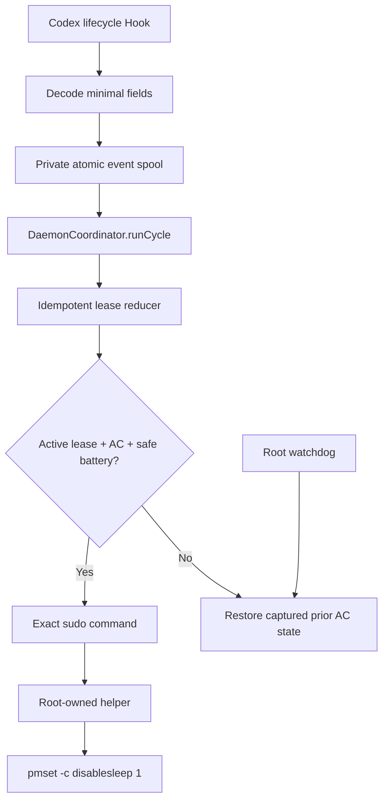

# Architecture / 架构说明

[English](#english) | [简体中文](#简体中文)

## English

### Design goals

- Observe actual Codex task activity rather than application presence.
- Keep Hooks fast and independent of privilege escalation.
- Support overlapping sessions and turns.
- Restore only power state the project owns.
- Fail safe after missing events, process crashes, AC loss, low battery, or
  stale heartbeats.
- Make all automated tests incapable of changing live power policy.

### Runtime flow



The Hook's interface is one JSON object on stdin and inert `{}` on stdout. It
does not know about leases, power sources, sudo, or launchd.

`DaemonCoordinator.runCycle` is the main runtime interface. It owns the
ordering between event consumption, startup recovery, maintenance scheduling,
IOKit sampling, privileged heartbeat cadence, and reconciliation. This keeps
stateful timing rules out of the CLI loop.

### Core modules

| Module | Responsibility |
|---|---|
| `HookProcessor` | Decode only required Hook fields and create canonical events |
| `HookEventPipeline` | Private atomic queue, validation, ordering, replay IDs, bounded drain |
| `LeaseReducer` | Acquire, renew, delayed release, session release, hard expiry |
| `DaemonCoordinator` | Decide when a cycle needs power/state reconciliation |
| `KeeperReconciler` | Convert leases, configuration, and power snapshot into an action |
| `PrivilegedPowerManager` | Capture prior AC state, enable, heartbeat, and restore |
| `LockedStateStore` | Cross-process serialization and atomic state persistence |

### Privilege seam

The normal user process may invoke exactly:

```text
sudo -n /Library/PrivilegedHelperTools/com.zundu.codex-lid-keeper power enable
sudo -n /Library/PrivilegedHelperTools/com.zundu.codex-lid-keeper power restore
```

The executable and parent directory are root-owned. No Hook-controlled argument
crosses this seam. Watchdog execution is launched as root by launchd and uses a
fixed command.

### Ownership protocol

Before the first change, the root helper:

1. reads the AC section of `pmset -g custom`;
2. records whether AC `disablesleep` was already enabled;
3. writes a root-owned ownership record;
4. enables only the AC profile;
5. updates the record timestamp on heartbeat.

Restoration reads the record, writes the captured value, and removes the record
only after a successful command. A malformed record is never guessed.

### Failure behavior

| Failure | Expected behavior |
|---|---|
| Hook times out or queue is full | Codex proceeds; existing ownership remains watchdog-protected |
| Daemon crashes after state save | Event replay ID prevents duplicate semantic application |
| Daemon disappears | Root watchdog restores after heartbeat expiry |
| AC is removed | User reconciliation restores within maintenance cadence; watchdog is independent |
| Battery is below threshold | Ownership is restored |
| Event is missing | Lease eventually reaches hard expiry |
| Future-dated event | Event is rejected beyond five-minute skew |
| Ownership record is malformed | Refuse to guess; surface an error |
| Configuration is invalid | User daemon fails closed; emergency restore remains available |

### Persistence

```text
~/Library/Application Support/CodexLidKeeper/
├── config.json
├── state.json
├── state.lock
├── daemon.lock
├── keeper.log
├── keeper.log.1
└── events/pending/*.json

/var/db/com.zundu.codex-lid-keeper.power.json
```

User data is private to the current account. The ownership record is root-only.
Prompts and tool payloads are not part of any persisted model.

## 简体中文

### 设计目标

- 跟踪真实 Codex 任务活动，而不是仅判断应用是否打开。
- Hook 快速返回，不依赖提权。
- 支持重叠的 session 与 turn。
- 只恢复本项目明确拥有的电源状态。
- 在事件丢失、进程崩溃、拔电、低电量或心跳过期后安全恢复。
- 自动测试不能修改真实电源策略。

### 运行链路

Hook 只解析必要字段并写入私有原子队列。`DaemonCoordinator.runCycle` 统一负责
队列消费、启动恢复、维护调度、IOKit 采样、特权心跳和状态协调。CLI 不需要自己
维护这些时序规则。

核心模块分工：

- `HookProcessor`：解析 Hook 并生成规范事件；
- `HookEventPipeline`：原子队列、验证、排序、重放 ID 和批量上限；
- `LeaseReducer`：获取、续期、延迟释放、session 释放与硬过期；
- `DaemonCoordinator`：决定何时需要状态与电源协调；
- `KeeperReconciler`：把租约、配置和电源快照转成动作；
- `PrivilegedPowerManager`：记录 AC 原值、启用、心跳与恢复；
- `LockedStateStore`：跨进程序列化和原子持久化。

### 权限接口

普通用户进程只能调用两条固定 sudo 命令：

```text
power enable
power restore
```

获得授权的可执行文件及父目录由 root 所有，Hook 无法控制传入 root 的参数。

### 所有权协议

第一次修改前，root 辅助程序读取 `pmset -g custom` 的 AC 区域，记录
`disablesleep` 是否原本开启，写入 root 所有权记录，然后只修改 AC 配置。恢复时
读取并写回原值，成功后才删除记录。记录损坏时拒绝猜测。

### 故障恢复

- Hook 超时或队列满：Codex 继续运行，已有电源状态仍受 watchdog 保护。
- daemon 在保存状态后崩溃：事件重放 ID 防止重复语义。
- daemon 消失：root watchdog 在心跳过期后恢复。
- 拔电或低电量：用户协调器恢复，root watchdog 也会独立检查。
- 生命周期事件丢失：租约最终硬过期。
- 事件时间超前过多：拒绝该事件。
- 所有权记录损坏：报错并拒绝猜测。
- 配置无效：daemon 安全失败，紧急恢复仍可用。

持久化目录不包含提示词或工具载荷；用户状态仅当前账户可访问，电源所有权记录仅
root 可访问。
