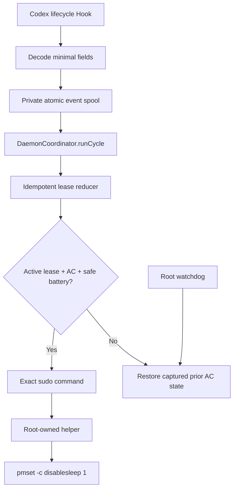

# Architecture / 架构说明

[English](#english) | [中文](#中文说明)

## English

### Design goals

- Observe actual Codex task activity rather than application presence.
- Keep Hooks fast and independent of privilege escalation.
- Support overlapping sessions and turns.
- Restore only power state the project owns.
- Fail safe after missing events, process crashes, AC loss, low battery, or
  stale heartbeats.
- Make all automated tests incapable of changing live power policy.

### Runtime flow



The Hook's interface is one JSON object on stdin and inert `{}` on stdout. It
does not know about leases, power sources, sudo, or launchd.

`DaemonCoordinator.runCycle` is the main runtime interface. It owns the
ordering between event consumption, startup recovery, maintenance scheduling,
IOKit sampling, privileged heartbeat cadence, and reconciliation. This keeps
stateful timing rules out of the CLI loop.

### Core modules

| Module | Responsibility |
|---|---|
| `HookProcessor` | Decode only required Hook fields and create canonical events |
| `HookEventPipeline` | Private atomic queue, validation, ordering, replay IDs, bounded drain |
| `LeaseReducer` | Acquire, renew, delayed release, session release, hard expiry |
| `DaemonCoordinator` | Decide when a cycle needs power/state reconciliation |
| `KeeperReconciler` | Convert leases, configuration, and power snapshot into an action |
| `PrivilegedPowerManager` | Capture prior AC state, enable, heartbeat, and restore |
| `LockedStateStore` | Cross-process serialization and atomic state persistence |

### Privilege seam

The normal user process may invoke exactly:

```text
sudo -n /Library/PrivilegedHelperTools/com.zundu.codex-lid-keeper power enable
sudo -n /Library/PrivilegedHelperTools/com.zundu.codex-lid-keeper power restore
```

The executable and parent directory are root-owned. No Hook-controlled argument
crosses this seam. Watchdog execution is launched as root by launchd and uses a
fixed command.

### Ownership protocol

Before the first change, the root helper:

1. reads the AC section of `pmset -g custom`;
2. records whether AC `disablesleep` was already enabled;
3. writes a root-owned ownership record;
4. enables only the AC profile;
5. updates the record timestamp on heartbeat.

Restoration reads the record, writes the captured value, and removes the record
only after a successful command. A malformed record is never guessed.

### Failure behavior

| Failure | Expected behavior |
|---|---|
| Hook times out or queue is full | Codex proceeds; existing ownership remains watchdog-protected |
| Daemon crashes after state save | Event replay ID prevents duplicate semantic application |
| Daemon disappears | Root watchdog restores after heartbeat expiry |
| AC is removed | User reconciliation restores within maintenance cadence; watchdog is independent |
| Battery is below threshold | Ownership is restored |
| Event is missing | Lease eventually reaches hard expiry |
| Future-dated event | Event is rejected beyond five-minute skew |
| Ownership record is malformed | Refuse to guess; surface an error |
| Configuration is invalid | User daemon fails closed; emergency restore remains available |

### Persistence

```text
~/Library/Application Support/CodexLidKeeper/
├── config.json
├── state.json
├── state.lock
├── daemon.lock
├── keeper.log
├── keeper.log.1
└── events/pending/*.json

/var/db/com.zundu.codex-lid-keeper.power.json
```

User data is private to the current account. The ownership record is root-only.
Prompts and tool payloads are not part of any persisted model.

## 中文说明

### 设计时先守住几条线

- 判断依据是“Codex 有没有任务在跑”，不是“Codex 窗口开没开”；
- Hook 只负责报信，不能在里面等 sudo；
- 多个 session、多个 turn 要能同时存在，互不误伤；
- 只恢复自己改过的设置，不能顺手覆盖用户原来的配置；
- 丢事件、崩进程、拔电、低电量都要能收尾；
- 自动测试绝不能碰开发机真实的电源设置。

### 一条事件怎么走

Codex 调用 Hook 后，`HookProcessor` 只取任务识别所需的几个字段，
`HookEventPipeline` 随即把事件写进私有队列。写完 Hook 就返回，不参与后面的
电源判断。

后台的 `DaemonCoordinator.runCycle` 是整条运行链路的入口。它负责决定：

- 现在要不要消费队列；
- 启动时是否需要清理上次遗留的状态；
- 什么时候读取 IOKit；
- 什么时候续 root 心跳；
- 什么时候让 `KeeperReconciler` 重新判断。

这样，CLI 只负责循环调用，不需要自己拼一堆时间和状态条件。

几个核心模块分别做这些事：

- `HookProcessor`：把 Hook 输入整理成统一事件；
- `HookEventPipeline`：写队列、校验、排序、去重和分批处理；
- `LeaseReducer`：新增任务、续期、延迟结束和强制过期；
- `DaemonCoordinator`：安排每一轮后台工作；
- `KeeperReconciler`：结合任务、电源和配置，决定保持还是恢复；
- `PrivilegedPowerManager`：记录原值、修改 AC 设置、续心跳和恢复；
- `LockedStateStore`：保证多个进程不会把状态文件写乱。

### sudo 边界

普通用户进程只能通过 sudo 调两条固定命令：

```text
power enable
power restore
```

被授权的程序和它所在的目录都归 root 管。Hook 不能追加参数，也不能让 root 去改
别的设置。

### 怎么判断“这项设置归我管”

第一次修改前，root Helper 会读取 `pmset -g custom` 的 AC 部分，把
`disablesleep` 原值写进 root 所有的记录文件，然后才执行修改。

恢复时先读记录，再写回原值。命令成功以后才删除记录。如果记录坏了，就报错停下，
绝不猜一个值硬写。

### 各种故障会怎样

- **Hook 超时或队列满：** 不拦 Codex；已经接管的电源状态继续由 watchdog 兜底。
- **保存状态后 daemon 崩了：** 重启后可能重读事件，但事件 ID 会拦住重复执行。
- **daemon 一直没回来：** root watchdog 等心跳过期后恢复。
- **运行中拔电或电量过低：** 正常后台会恢复，root watchdog 也会单独检查。
- **结束事件丢了：** 租约到最长时间后自动过期。
- **事件时间明显不对：** 比本机快五分钟以上就直接丢弃。
- **所有权记录损坏：** 报错，不猜原值。
- **配置文件写坏了：** 后台停止接管，但紧急恢复命令仍然可用。

用户目录里只保存任务识别、配置、状态和日志，不保存提示词或工具内容。root
所有权记录只有 root 能访问。
